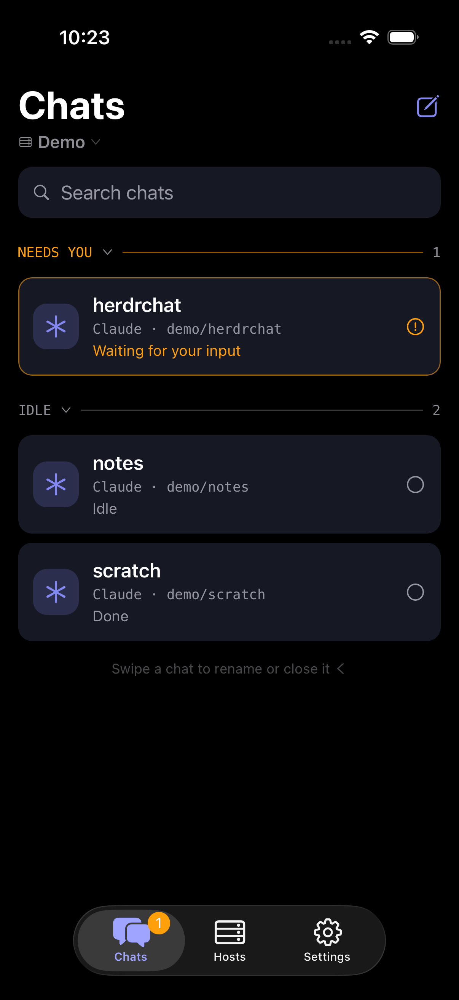
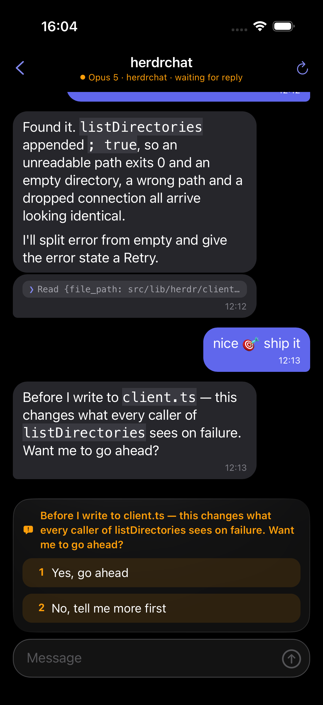

  

<h1 align="center">HerdrChat</h1>

  <strong>Claude Code and Codex, in your pocket.</strong> 
  Check a reply. Unblock an agent. Get back to your coffee.

  <a href="https://apps.apple.com/app/herdrchat/id6791874615"><strong>Download on the App Store</strong></a> ·
  <a href="https://herdrchat.cobanov.dev">Website</a> ·
  <a href="docs/getting-started.md">Get started</a> ·
  <a href="https://github.com/cobanov/herdrchat/issues">Issues</a>

Your agents keep running on your computer. HerdrChat turns their
[herdr](https://herdr.dev) workspaces into readable conversations on your iPhone or iPad,
connected directly over SSH. No HerdrChat account. No relay server.

  
  
   
  Demo conversations, captured in the iOS simulator. Tap a screenshot to zoom.

## Less terminal. More conversation.

- **Pick up where you left off.** Read Claude Code and Codex history, including replies started at your desk.
- **See what needs you.** Search chats grouped by Needs you, Working and Idle. On iPad, keep the list beside your conversation.
- **Keep things readable.** Message bubbles, code blocks, tables and compact tool activity.
- **Give an agent a nudge.** Send a follow-up or tap a supported approval choice.
- **Keep your machine yours.** Connect over SSH, usually through Tailscale. Credentials stay in the iOS Keychain; host keys are pinned.

## Try it

Just curious? Open the built-in **Demo** host. No server setup needed.

For your own agents:

1. Install HerdrChat from the [App Store](https://apps.apple.com/app/herdrchat/id6791874615) (free), or [build it locally](docs/getting-started.md#build-the-ios-app).
2. Set up herdr and the [Claude or Codex integration](docs/getting-started.md#prepare-your-computer) on your computer.
3. Add that computer in **Hosts**, test the SSH connection, and open a chat.

**On the App Store** for iPhone and iPad, iOS 17+. Android is experimental.
Push notifications need extra setup on your host. See
[setup and limitations](docs/getting-started.md).

## Want to tinker?

Expo + React Native + TypeScript, with a native SSH module. The agents run on
your computer, not on the phone.

[Build & test](docs/getting-started.md#build-the-ios-app) ·
[Contributing](CONTRIBUTING.md) ·
[Conventions](CLAUDE.md) ·
[Releasing](RELEASING.md) ·
[Security](SECURITY.md)

---

[Apache-2.0](LICENSE) · [Third-party notices](NOTICE)
