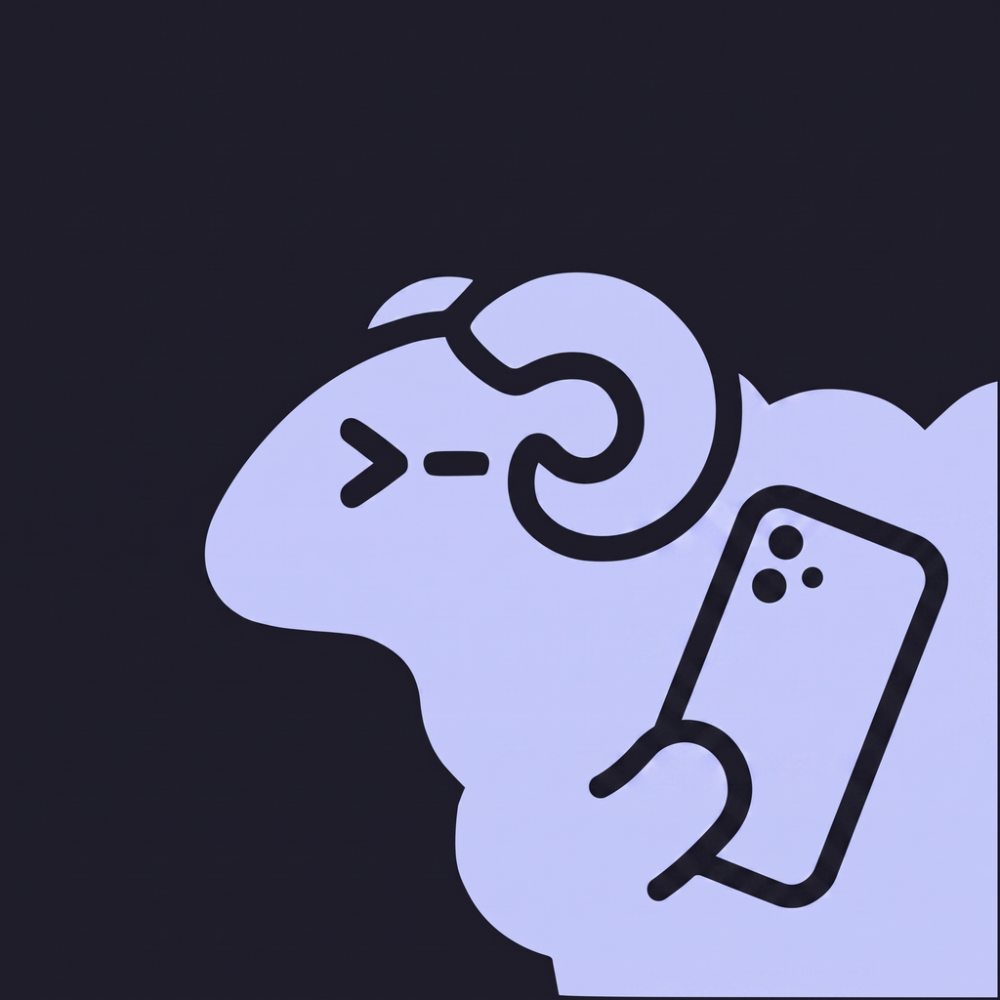

<p align="center">
  
</p>

<p align="center">
  Your coding agents, as a chat on your phone — over SSH to your own machine,
  with nothing in between.
</p>

<p align="center">
  <a href="https://github.com/cobanov/herdrchat/actions/workflows/ci.yml"></a>
  
  
  
  <a href="LICENSE"></a>
</p>

---

Agents run on the machine under your desk, and checking on one means opening a
laptop — or SSHing in from a phone to a TUI that was never designed for a
six-inch screen and a soft keyboard. HerdrChat makes each [herdr][herdr]
workspace a conversation instead.

It does not scrape the terminal. herdr's `pane.read` returns the raw TUI buffer,
which is noise; this reads Claude Code's own transcript files, which hold
structured turns. That is the whole reason the bubbles are clean, and why a tool
call can be a chip rather than a wall of output.

```
 herdrchat                                        0.7.7   macmini

   herdrchat          ● working   Tests are green — 314 passing
 > helva-todo         ○ idle      Added the recurring-task migration
   fight-sim-main     ! blocked   Do you want to proceed?

   +  new chat

 Chats            Hosts            Settings
```

- **No account and no server.** Your phone talks to your machine and to nothing
  else. In normal use it rides your existing Tailscale network, so nothing is
  exposed publicly.
- **Keys stay in the Keychain**, never in the app's database and never off the
  device. Host keys are pinned on first use, and a changed key is refused rather
  than warned about.
- **Answer a blocked agent in two taps.** A prompt's options are parsed into
  labelled buttons, so choosing one is a tap rather than a guess at which number
  to type.
- **Notifications come from your own machine.** A watcher you run signs with
  your own Apple push key and talks to APNs directly.

Builds for **iOS 17+**, and is verified on **iPhone 17 Pro, iOS 26.5** against a
real host.

## Install

The app is in TestFlight. To run it yourself you need Node 22+, Xcode 26+, and an
iOS 17+ device or simulator. The Liquid Glass surfaces need iOS 26; below that
the app falls back to a solid one.

```bash
npm install
npx expo prebuild --clean
npx expo run:ios --device "iPhone 17 Pro"
```

On the machine you want to reach you need [herdr][herdr], Claude Code, and —
this one is not optional:

```sh
herdr integration install claude
```

Without it herdr never learns Claude Code's session id, and the app cannot tell
one conversation in a directory from another. It refuses to guess, so threads
open empty and say so. The hook fires at session start, so **agents already
running when you install it must be restarted** before they report anything.

Then add a host in the app. The connection has to pass a live test before it can
be saved — a saved-but-broken host produces a chat list that fails with no
visible cause.

**Notifications** are opt-in and need one more thing: an **APNs auth key** from
Apple Developer → Keys, which is not the same as an App Store Connect API key.
Your device's token is written to a file on your own host over the same SSH
connection, and `scripts/herdr-apns-notifier.py` there pushes to Apple with your
key. Nothing of ours is in the path, because nothing of ours exists.

## Build

```bash
npx tsc --noEmit          # zero errors
npx expo lint             # zero errors
npx jest                  # 314 tests
maestro test .maestro/smoke.yaml .maestro/new-chat.yaml .maestro/folder-picker.yaml
```

`.maestro/add-server.yaml` needs a real host and reads its credentials from the
environment, so no key is ever committed. Shipping is `scripts/testflight.sh` —
see [RELEASING.md](RELEASING.md). `ios/` and `android/` are generated: change
`app.json` or a config plugin and re-run prebuild, never the generated project.

## How it is built

```
iPhone — React Native / Expo, New Architecture
   │  SSH, normally over Tailscale. Existing keys, no public surface.
   ▼
your machine
   ├─ herdr ─── snapshot, workspace list, pane run, agent wait
   └─ ~/.claude/projects/<escaped-cwd>/<session>.jsonl ─── tailed for messages
```

`src/lib/` is the core and the reason the thing is testable: herdr protocol and
client, transcript parsing, the byte-windowed store, blocked-prompt scraping. It
imports neither React nor the SSH module, so all of it runs against a canned
transport. Routes in `app/` stay thin, the SSH transport is a local Expo module
under `modules/herdr-ssh/`, and `site/` is [herdrchat.cobanov.dev][site] —
privacy policy included, so the published page and the behaviour it describes
are reviewed together.

[`CLAUDE.md`](CLAUDE.md) has the conventions and, more usefully, the rules that
were learned by running the thing: why a chat's identity is its session and not
its workspace slot, why offsets are UTF-8 bytes and not string length, why glass
lives in exactly one file. Reading it will save you a review round.

HerdrChat was two native apps first, in SwiftUI and Jetpack Compose. Both are in
the git history before the Expo rewrite, if you want the same product across
three stacks.

## Status

Everything described above works on iOS. What does not, yet:

- **Notifications end to end** — the app registers and the entitlement ships,
  but the host-side sender has never been set up ([#2][i2]).
- **Android** — it compiles and the SSH module is written in Kotlin, but it has
  never been run and there is no release path ([#4][i4]).
- **Public TestFlight** — build 51 is with Apple for Beta App Review ([#3][i3]).
  The [public link][testflight] opens to everyone once that passes.
- **The App Store** — not submitted. The listing needs screenshots, a category
  and an age rating before it can be.

Open [issues][issues] are the honest version of this list.

## Trying it without a host

The app is useless without a machine you administer — so it ships with one that
does not exist. On first launch, with no hosts configured, it opens on a **demo
host**: three sample workspaces, a real conversation, an agent that answers a
prompt and replies to a message.

That demo is not a mock screen. `HerdrTransport` has two methods, so the
fictional host slots in underneath everything — the chat list, the transcript
reader, the byte cursor, the blocked bar and the live tail all run their real
code and cannot tell the difference. It is the app, with the machine replaced.

## Contributing

Issues and pull requests welcome. Before opening one:

```bash
npm run typecheck && npm run lint && npm test
```

CI runs exactly those three on every pull request. [CONTRIBUTING.md](CONTRIBUTING.md)
covers the rest — where logic belongs, why route files stay thin, and which
rules were learned the hard way.

Security problems go through [SECURITY.md](SECURITY.md) rather than a public
issue: this app holds SSH credentials for machines you own.

## Licence

[Apache-2.0](LICENSE). Third-party components and their licences are in
[NOTICE](NOTICE).

[herdr]: https://herdr.dev
[site]: https://herdrchat.cobanov.dev
[issues]: https://github.com/cobanov/herdrchat/issues
[i2]: https://github.com/cobanov/herdrchat/issues/2
[i3]: https://github.com/cobanov/herdrchat/issues/3
[i4]: https://github.com/cobanov/herdrchat/issues/4
[testflight]: https://testflight.apple.com/join/zTmVfpkn
